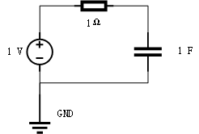

# OptControl.jl设计思路

!!! tip
    Contents：OptControl：最优控制问题的解释器

    Contributor: YJY

    Email:522432938@qq.com

    如有错误，请批评指正。

!!! note

    [OptControl](https://ai4energy.github.io/OptControl.jl/dev/)地址。

    [arXiv文章引用](https://arxiv.org/abs/2207.13229)

## 摘要

最优控制问题的本质是一个优化问题。OptControl.jl(OptControl)基于Julia语言，实现了最优控制的符号化建模过程，并生成相应的基于Julia生态的最优控制问题的数值优化求解代码。OptControl没有定义数据类型(struct)，而是通过处理字符生成解决方案脚本，并在内部解析并运行脚本。OptControl也提供保存脚本文件到本地的接口。同时，OptControl支持组件化建模，这让构建复杂系统的最优控制问题变得简单。OptControl的依赖包完全来自于Julia生态。

## 1 Motivation

最优控制问题的本质是一个优化问题，更准确的说是一个泛函求极值问题。从实现的角度，最优控制的解析解只有在特定的几种情况下才能求出，例如线性系统。而实际问题中往往需要面对非线性系统或者一些复杂的系统，这些问题的解析解一般而言难以求得。因此，能算出结果的数值解则是一个利器。虽然数值解在结果上会有一些偏差，但有偏差的结果也能带给人们一定理解问题的灵感。

最优控制问题的数值解法一般而言可以转化为数值优化问题。数值优化问题可以使用JuMP.jl来求解。使用JuMP.jl求解一个最优控制问题，可以分为5步：

1. 抽象实际问题
2. 获得状态方程模型
3. 构建数值优化模型
4. 生成JuMP模型
5. 求解

事实上，JuMP.jl完成了第4步，第5步的内容由具体的求解器完成。但JuMP.jl在完成第4步的基础上，提供了到第5步的接口。因此也可以认为，JuMP.jl包揽了第4步和第5步的工作。那么整个问题需要留给用户解决的，还有前3步。它们的关系由下图所示。

  

事实上，第一步包含了从实际问题到数学表达的抽象过程，这一过程只有高级的人脑才能完成。那么，第2步和第3步能否实现自动化呢？这正是OptControl所希望完成的内容。

OptControl的重点在于自动化，即如何自动构建最优问题，如何自动构建JuMP优化模型以及调用求解器自动求解。如何求解一个最优问题，如何构建符号化的系统等类型的问题，OptControl都不涉及。OptControl关心的是，整合已有的资源（Julia生态中的各种软件包），尽可能地自动化完成上述5个步骤。

所以可以视OptControl是一个解释器，实现状态空间模型到最优控制问题的转化。它有三个特点：

1. 接受Symbolics.jl或ModelingToolkit.jl构建的基于符号系统的状态空间模型
2. 自动生成以JuMP模型表达的最优化问题求解脚本，并自动运行
3. 提供保存脚本文件的接口，供用户自由修改

## 2 OptControl框架

OptControl的能力是逐步提高的。

### 2.1 构建优化模型

首先完成的是第3步到第5步的解决方案。该解决方案的函数是

* generateJuMPcodes——处理线性系统
* generateNLJuMPcodes——处理非线性系统

generateJuMPcodes与generateNLJuMPcodes接受以符号形式表达的状态方程。符号表达通过Symbolics.jl构建。Symbolics.jl是一个拥有高性能，并能够以用户语言进行拓展的符号代数系统。用符号表达的状态方程能够转变成Julia函数，通过该函数对问题进行离散化处理，将离散后的模型中的状态作为JuMP系统的优化变量，构建JuMP优化模型进行求解。

  

### 2.2 获得状态方程模型

更进一步，我们希望自动化实现第2步到第5步。第2步到第5步的解决方案需要使用ModelingToolkit.jl的非因果组件建模系统。该解决方案的函数是

* generateMTKcodes——处理ODESystem系统

generateMTKcodes接受ODESystem系统。ODESystem中描述系统的微分方程事实上就是最优控制问题的状态方程。它们的区别是，ODESystem系统中的某些变量在最优控制问题中是状态量，而另一些是控制量。换而言之即，在最优控制中的状态方程与仿真系统中的微分方程本质上是相同的，不同的是最优控制问题赋予了某些变量特殊的含义。

generateMTKcodes使用ModelingToolkit.jl中的generate_function函数生成Julia函数，并使用函数进行离散，将离散后的状态作为JuMP系统的优化变量，构建JuMP优化模型进行求解。2.1与2.2中解决方案的思路是相同的。它们都生成了Julia函数。2.1中的函数来自Symbolics.jl符号矩阵，2.2中的函数来自ModelingToolkit.jl中的ODESystem。OptControl利用生成的Julia函数进行状态空间的离散，并构建JuMP优化模型。

  

## 3 OptControl中的数学推演

### 3.1 仿真或者控制？

最优控制问题的中描述系统的方程为:

```math
\dot{\boldsymbol{x}(t)}=\boldsymbol{A}\boldsymbol{x}(t)+\boldsymbol{B}\boldsymbol{u}(t)=f[\boldsymbol{x}(t),\boldsymbol{u}(t),t]\tag{1}
```

其中，$\boldsymbol{x(t)}$是系统的状态向量，$\boldsymbol{u(t)}$是系统的控制量向量。它们都是关于自变量t的函数，也就是说它们随时间的变化而变化。事实上，在控制问题中，系数矩阵$\boldsymbol{A},\boldsymbol{B}$也是可以随时间而变化的，则变为$\boldsymbol{A(t)},\boldsymbol{B(t)}$。这根据实际需要而定。

省去关于时间的函数表达，上述方程可以简写成：

```math
\dot{\boldsymbol{x}}=\boldsymbol{A}\boldsymbol{x}+\boldsymbol{B}\boldsymbol{u}=f(\boldsymbol{x},\boldsymbol{u},t)\tag{2}
```

如果从数学的角度思考，不考虑$\boldsymbol{x},\boldsymbol{u}$的物理含义，这是一个关于时间的常微分方程问题。如果$\boldsymbol{u}$的值不人为地决定，而是在系统中自我演化。那么这个就是一个微分方程求解问题。

```math
\dot{\boldsymbol{x}}=f(\boldsymbol{x},\boldsymbol{p},t)\tag{3}
```

求解该微分方程的在真实世界中对应系统的动态仿真。

所以，控制问题和动态仿真问题的本质是相同的。系统的描述方程都为关于时间的微分方程（组）。不同之处在于，问题的中的某些变量是否可以人为介入改变。也可以说，动态仿真问题是我们希望看到系统是如何演化的，而控制问题是，我们希望系统按照我们的期望去演化。正因为我们有期望，所以我们需要介入，对系统进行人为干预。而在方程中的体现是$\boldsymbol{u}$，$\boldsymbol{u}$是对系统干预的数学表达。所以，如果我们构造了$\boldsymbol{u}$而不改变它，即它没有起到干预的作用，那这样的问题仍然是一个动态仿真问题。因为人的影响并没有通过$\boldsymbol{u}$传递到系统。

这正是为何OptControl能够用ModelingToolkit.jl构建系统的原因。ModelingToolkit.jl原本是用来构建动态仿真问题的工具，ODESystem描述的是动态系统的仿真模型，它并不存在可以人为干预系统的接口——控制变量$\boldsymbol{u}$。我们可以构建ODESystem，观察系统是怎样变化的，而不能从头至尾地控制它的演化方向（事实上，偶尔的干预是可以通过Callback功能实现的，但它远没有达到“控制”的内涵）。

但我们只要稍加改变，就能够将仿真问题转变为控制问题。只需要给ODESystem中的某些变量加上控制属性，工作就完成了。这正是OptControl使用的方法——把ODESystem中的参数$\boldsymbol{p}$变为了控制量$\boldsymbol{u}$。就得到到了控制问题中状态空间方程的最原始形式。

```math
\dot{\boldsymbol{x}}=f(\boldsymbol{x},\boldsymbol{p},t)\Rightarrow \dot{\boldsymbol{x}}=f(\boldsymbol{x},\boldsymbol{u},t)\tag{4}
```

为了实现这一点，在构建ODESystem时需要做一点设计——需要把我们系统中某需要转变为控制量的变量设置成参数$\boldsymbol{p}$。

### 3.2 最优控制怎样最优

上一节中我们探讨了$\boldsymbol{u}$的内涵。那么还剩下一个问题是，如何用于数学语言描述最优。整个最优问题可以分为两个部分，控制过程中的最优以及控制终态的最优。方程5表示对最优的一个目标。

```math
\min ~~~\Phi(\boldsymbol{x}(t_f),t_f)+\int_{t_0}^{t_f} L[\boldsymbol{x}(t),\boldsymbol{u}(t),t]dt  \tag{5}
```

其中，$\Phi(\boldsymbol{x}(t_f),t_f)$表示对终端状态的一个期望，积分$\int_{t_0}^{t_f} L[\boldsymbol{x}(t),\boldsymbol{u}(t),t]dt$表示控制过程中的期望状态达到的最小指标。

方程2和方程5合起来，就成为了最优控制问题控制方程的一般形式。

```math
\begin{matrix}
\min~~~~\Phi(\boldsymbol{x}(t_f),t_f)+\int_{t_0}^{t_f} L[\boldsymbol{x}(t),\boldsymbol{u}(t),t]dt\\s.t. \hspace{1.0cm} \dot{\boldsymbol{x}} =
f[\boldsymbol{x}(t),\boldsymbol{u}(t),t] 
\end{matrix} \tag{6}
```

### 3.3 数值优化模型

方程6是连续形式，如果采用数值优化方法则需要将其离散化。离散方法采用欧拉法，则有:

```math
\begin{matrix}
\min~~~~\Phi(\boldsymbol{x}(t_f),t_f)+\sum_{i=1}^{n} L(\boldsymbol{x}_i,\boldsymbol{u}_i,t_i) \\s.t. \hspace{0.4cm} \boldsymbol{x}_{i+1} =\boldsymbol{x}_{i}+f(\boldsymbol{x}_i,\boldsymbol{u}_i,t_i)*dt
\end{matrix} \tag{6}
```

如果采用后退欧拉法则有：

```math
\begin{matrix}
\min~~~~\Phi(\boldsymbol{x}(t_f),t_f)+\sum_{i=1}^{n} L(\boldsymbol{x}_i,\boldsymbol{u}_i,t_i) \\s.t. \hspace{0.4cm} \boldsymbol{x}_{i+1} =\boldsymbol{x}_{i}+f(\boldsymbol{x}_{i+1},\boldsymbol{u}_{i+1},t_{i+1})*dt
\end{matrix} \tag{7}
```

此外，还有很多的离散方法，如梯形法，亚当斯方法等等。

一旦获得了方程6和方程7的结果，下一步可以用JuMP.jl来构建相应的JuMP模型，以便调用相关的求解器求解。这由OptControl自动化地完成。

## 4 求解实例

### 4.1 Case1: 线性系统最优控制问题

求解以下线性最优控制问题：

```math
min \int_{0}^{2} u^2dt \newline s.t. ~~~~~ \dot{\boldsymbol{x}} =\begin{bmatrix}0&1 \newline 0&0\end{bmatrix}\boldsymbol{x}+ \begin{bmatrix}0 \newline 1 \end{bmatrix}u \newline \boldsymbol{x}(0) = \begin{bmatrix} 1 \newline 1 \end{bmatrix}, \boldsymbol{x}(2)=\begin{bmatrix} 0 \newline 0 \end{bmatrix}
```

使用OptControl求解该问题的步骤是：

1. 使用ModelingToolkit.jl或者Symbolics.jl描述系统方程
2. 确定初态和终态等参数
3. 调用generateJuMPcodes求解

```julia
using OptControl, Statistics, ModelingToolkit
@variables t u x[1:2]
f = [0 1; 0 0] * x + [0, 1] * u
L = 0.5 * u^2
t0 = [1.0, 1.0]
tf = [0.0, 0.0]
tspan = (0.0, 2.0)
N = 100
sol = generateJuMPcodes(L, f, x, u, tspan, t0, tf; N=N)
```

该最优问题中，$x_1$的解析解是

$$x_1(t) = 0.5*t^3-1.75*t^2+t+1$$

比较解析解和优化数值解，可以得到它们的均方差是2.696E-6。在这个误差下的结果即使不能使用，它也是极具参考意义的，能给与人们启示。

### 4.2 Case2: 非线性系统最优控制问题

求解以下非线性最优控制问题：

```math
min \int_{0}^{2} u^2dt \newline s.t. ~~~~~ \dot{\boldsymbol{x}} =\begin{bmatrix}exp&cos \newline sin&1\end{bmatrix}\boldsymbol{x}+ \begin{bmatrix}0 \newline 1 \end{bmatrix}u \newline \boldsymbol{x}(0) = \begin{bmatrix} 1 \newline 1 \end{bmatrix}, \boldsymbol{x}(1)=\begin{bmatrix} 0 \newline 0 \end{bmatrix}
```

使用ModelingToolkit.jl或者Symbolics.jl定义符号变量，给定初态和终态。调用generateNLJuMPcodes则可以得到结果。

```julia
using OptControl, ModelingToolkit, Test
@variables t u x[1:2]
f = [exp(x[1]) + cos(x[2]), sin(x[1]) + x[2]] + [1, 0] * u
L = u^2
t0 = [1.0, 1.0]
tf = [0.0, 0.0]
tspan = (0.0, 2.0)
N = 100
sol = generateNLJuMPcodes(L, f, x, u, tspan, t0, tf; N=N)
```

### 4.3 Case3: RC电路系统最优控制

这是一个简单的电路系统。电源电压1V，电阻1欧姆，电容1法拉。

  

我们构造的最优控制问题是，电压如何变化才能使得电容电压在1s内从1V变化到3V的同时，满足整个过程中电压尽可能低的目标。这在物理上是有意义的，但是可能没有应用价值。但它能充分说明问题所在。

```julia
using OptControl, ModelingToolkit, Test

# Components ......

# Define and Simplify System
R = 1.0
C = 1.0
V = 1.0
@named resistor = Resistor(R=R)
@named capacitor = Capacitor(C=C)
@named source = ConstantVoltage(V=V)
@named ground = Ground()
rc_eqs = [
    connect(source.p, resistor.p)
    connect(resistor.n, capacitor.p)
    connect(capacitor.n, source.n)
    connect(capacitor.n, ground.g)
]
@named _rc_model = ODESystem(rc_eqs, t)
@named rc_model = compose(_rc_model,
    [resistor, capacitor, source, ground])
sys = structural_simplify(rc_model)

# Build Optimal Control Problem and Solve
L = 0.5 * (source.V^2)
t0 = [1.0]
tf = [3.0]
tspan = (0.0, 1.0)
N = 100
sol = OptControl.generateMTKcodes(L, sys, states(sys), [source.V], tspan, t0, tf;N=N)
```

上述代码的组件来自于ModelingToolkit.jl的文档。如果是一个仿真问题，当ODESystem被化简完成后应该需要调用DifferentialEquations.jl来求解。现在是一个最优控制问题，所以我们指定优化目标，以及定义相关参数，通过generateMTKcodes求解。

## 5 结论

OptControl实现了从状态方程到最优控制问题的自动化构建以及从ModelingToolkit的常微分方程系统到系统最优控制问题的自动化构建。问题的核心在于选择设计控制变量$\boldsymbol{u}$。在状态空间方程离散过程中，OptControl提供了选择离散方法的接口。在未来的工作中，会发展更多离散方法。

OptControl另外一个重要特点是，它不直接解决问题，而是生成解决方案脚本并解释运行。这意味OptControl像一个指挥者，它把问题分解，再调用Julia生态中的包解决问题。OptControl提供了获得脚本的接口，这意味当OptControl的功能不能满足你的需求时，你可以直接修改脚本。在它基础之上添加任何你需要的功能。如果你不熟悉JuMP的建模语言，那么你正好可以通过生成的脚本学习一些JuMP的高级用法。如果你还想选择一些不同的求解器，那就修改脚本吧。

在未来，OptControl也许会提供更多的接口。但它不会改变指挥者的角色。也就是说，OptControl会一直致力于自动化生成最优控制问题的解决方法，而不是像ModelingToolkit.jl和JuMP.jl发展一种建模语言，也不会像JuMP.jl调用的求解器一样发展求解算法。OptControl的初衷是打通壁垒，整合工具，方便快捷的解决最优控制的问题。
