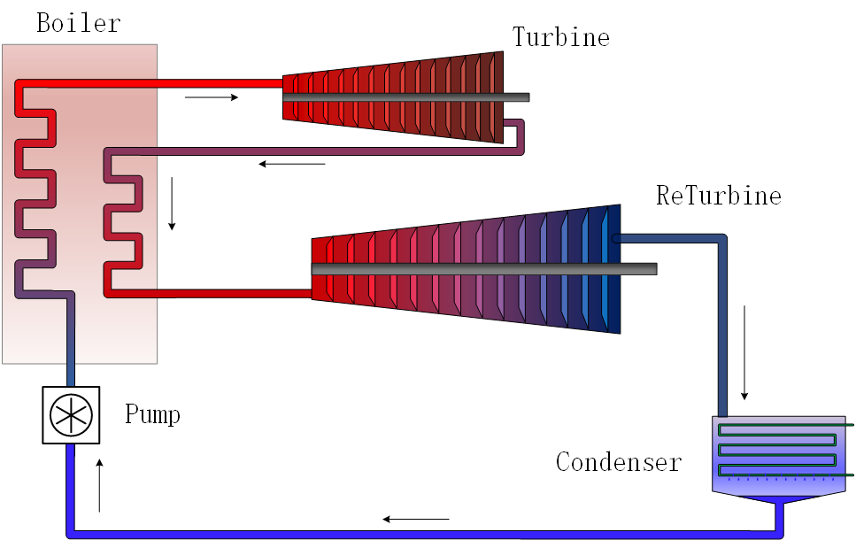

# Ai4EComponentLib.jl设计理念

!!! tip
    Contents：Ai4EComponentLib：Julia组件模型库

    Contributor: YJY

    Email:522432938@qq.com

    如有错误，请批评指正。

!!! note

    [Ai4EComponentLib](https://ai4energy.github.io/Ai4EComponentLib.jl/dev/)地址。

    [arXiv文章](https://arxiv.org/abs/2208.11352)

## 摘要

Ai4EComponentLib是基于Julia语言构建的组件化模型库。它依赖于微分方程求解器DifferentialEquations.jl与符号建模工具Modelingtoolkit.jl。面向不同的物理领域的问题，Ai4EComponentLib尝试使用组件化建模的方法去构建它们。在新一代符号建模工具的支持下，使用Ai4EComponentLib构建的模型比传统的用Modelica构建的模型更加灵活，并具有更高的可拓展性。本文将介绍Ai4EComponentLib模型库的实例与通用建模思想。

## 1 Motivation

在建模仿真领域，已经存在着许许多多的建模工具，例如Modelica、gProms、Simulink等等。它们在不同领域中都发挥着重要的作用，这些工具也已经成为科研工作者的必备工具。但这并不意味着，它们是完美无暇的。以开源的Modelica为例，Modelica拥有自己的编译器，能将建模语言编译成C语言。对于仿真问题来说，它形成了一个完备的解决方案链条。但它的缺陷是，不易扩展。它不能向外扩展形成优化问题的解决方案（参数辨识、最优控制问题）等等。而Julia生态中的ModelingToolkit就解决了扩展性不足的问题。在符号建模体系下，它具有高可拓展性。基于ModelingToolkit的工作，Ai4EComponentLib构建了一些模型库，期望在将来能够利用其高可拓展行的优势。

## 2 Ai4EComponentLib设计理念

Ai4EComponentLib设计系统的方法与传统的组件化建模思想是相通的。但由于ModelingToolkit的高可拓展性，我们将用更高一层的抽象来看待这个问题。

组件建模的核心在于**过程**，以及过程中的物质能量**流动**。建模过程中的两个关键点为：内部过程与外部连接。设计一个系统，也就是设计它们的内部过程与外部连接。

现有一个系统，系统中有3个组件A, B and C，如图所示，每个组件有各自的输入输出节点（如a1、a2等），其输入输出特性如箭头所示。

 

### 2.1 内部过程

各模块内部有自身的特性。即输入输出量之间在节点内部产生的反应与物质信息交换的过程。在组件与组件之间是各不相同的。这些机制反映了模型对现实实体的映射，是不同的数学物理现象的抽象。

例如上图组件A的a1、a2、a3。在组件内部，它们有特定的数学关系。

$$f(a1,a2,a3) = 0$$

在这里$f(a1,a2,a3)$是一种通用的函数形式，它可以是微分方程，也可以是代数方程。

例如，对于电阻组件，同样的电压差加在一个不同电阻的两端，流过的电流大小不同。若电阻是随时间变化的，那么系统的电流也是随时间变化的。“不同的电阻”与“随时间变化的电阻”都是组件的特性，在设计组件时，通过不同的方程$f$来描述。

这些方程就决定了“物质能量流动”流经组件时的变化。一旦系统中的组件确定了，整个系统的特性就能够通过这些组件确定下来。

### 2.2 外部连接

在构建系统连接时，我们关注点在于连接点的**物质和能量**。

1. 例如电路系统。电路系统的a2作为组件的出口，电流与电势值是必要的属性。同时，每个组件的进出口都存在电流与电势。所以，在电路系统中，电流与电势是连接系统的“物质流”。

2. 例如水流管道系统（不考虑势能）。管道系统的a2作为组件的出口，水流的压力与流速是必要的属性。每个组件的进出口都存在水压与流速属性。所以，在管道系统中，水压与流速连接系统的“物质流”。

具体的物质流动关系，我们需要根据特性系统的数学模型来构建。例如，电路系统中的基尔霍夫定律，管道流动的伯努利方程。**控制方程是描述系统的基础**。

在外部的连接特性中，一般都必须遵循守恒定律——能量守恒与质量守恒：

```math
\left\{\begin{array}{l}
|a 2|=|b 1| \\ |b 3|=|c 2| \\|a 3|=|c 1|
\end{array}\right.\tag{1}
```

对于状态量，如电压、水压、气体压力。一般有：

```math
\left\{\begin{array}{l}
a 2=b 1 \\ b 3=c 2 \\a 3=c 1
\end{array}\right.\tag{2}
```

对于过程量，如电流、水流量、气体流量。一般有（规定流入为正，流出为负）：

```math
\left\{\begin{array}{l}
a 2+b 1=0 \\ b 3+c 2 =0\\a 3+c 1=0
\end{array}\right.\tag{3}
```

## 3 系统实例

### 3.1 不可压缩管道系统

当管道中液体为不可压缩流体时，系统的控制方程为伯努利方程。

$$\frac{p}{\rho g} +\frac{v^{2}}{2g}  + h=\text { constant } \tag{4}$$

其中，$p$是压力，$v$是速度，h是高度。

写成流量形式则有，

$$\frac{p}{\rho g} +\frac{8q^{2}}{\pi^2D^4g} + h=\mathrm{constant} \tag{5}$$

其中，$p$是压力，$q$是流量，D是管道直径，h是高度。

伯努利方程描述的是管道内部液体流动的能量守恒定律。组件的内部过程是能量的增加或减少。

#### 3.1.1 管道组件

对于一个直管道，组件内部一般有沿程阻力损失与局部阻力损失。当液体从管道一端流向另一端时，液体的总能量减小。沿程阻力损失与局部阻力损失是管道组件的内部过程。其数学方程为：

$$\frac{p_{in}}{\rho g} +\frac{8q_{in}^{2}}{2\pi^2D^4g} + z_{in}=
\frac{p_{out}}{\rho g} +\frac{8q_{out}^{2}}{2\pi^2D^4g} + z_{out}+h_f+h_m\tag{6}$$

其中，下标$_{in}$代表管道进口，$_{out}$代表管道出口，${h_f}$表示沿程阻力损失，${h_m}$表示局部阻力损失。

沿程阻力损失方程为：

$$h_f = f\frac{L}{D} \frac{8q^{2}}{\pi^2D^4g}\tag{7}$$

其中，$f$为摩擦因数，$L$为管道长度，$D$为管道直径。

局部阻力损失方程为：

$$h_m = K \frac{8q^{2}}{\pi^2D^4g}\tag{8}$$

其中，$K$为局部阻力系数。

管道的外部连接主要为压力与流量(高度也是，暂不考虑)。压力是状态量，流量是过程量。在两个组件a,b之间，有：

$$p_a=p_b\\q_a+q_b=0$$

#### 3.1.2 离心泵组件

与管道组件类型，离心泵组件的内部过程是为流体增加能量。

$$\frac{p_{in}}{\rho g} +\frac{8q_{in}^{2}}{2\pi^2D^4g} + z_{in}=
\frac{p_{out}}{\rho g} +\frac{8q_{out}^{2}}{2\pi^2D^4g} + z_{out}+H_t\tag{9}$$

其中，$H_t$表示流经离心泵增加的能量。

$$H_t=\frac{(r\omega)^2}{g}-\frac{\omega \cot\beta }{2\pi bg}Q=c_0\omega^2-c_1\omega Q=a_0-a_1Q\tag{10}$$

其中，$a_0,a_1$代表水泵特性参数，方程10实际上是水泵的理论扬程流量曲线。

#### 3.1.3 组件与系统

构建系统的水泵、管道等主要组件之前，建立ModelingToolkit中的Connector（Connector中的变量在管道系统中为压力与流量）。代码仓库中有详尽的代码可以查看。

```julia
# Component: SimplePipe(pipe with fixed friction factor `f`)
function SimplePipe(; name, L=10.0, D=25E-3, f=0.01, ρ=1.0E3, zin=0.0, zout=0.0, K_inside=0.0)
    @named in = PipeNode(z=zin)
    @named out = PipeNode(z=zout)
    ps = @parameters D = D L = L f = f K_inside = K_inside
    eqs = [
        _NodeEnergy(in, D, ρ) ~ _NodeEnergy(out, D, ρ) + _h_f(in, f, L, D) + _h_m(in, K_inside, D)
        0 ~ in.q + out.q
    ]
    compose(ODESystem(eqs, t, [], ps, name=name), in, out)
end

# Component: CentrifugalPump
function CentrifugalPump(; name, D=25E-3, ω=2500, c_0=4.4e-4, c_1=5.622, ρ=1.0E3)
    @named in = PipeNode()
    @named out = PipeNode()
    a_0 = c_0 * abs2(ω * 2π / 60)
    a_1 = c_1 * ω * 2π / 60
    ps = @parameters D = D
    eqs = [
        _NodeEnergy(in, D, ρ) + a_0 - a_1 * abs(in.q) ~ _NodeEnergy(out, D, ρ)
        0 ~ in.q + out.q
    ]
    compose(ODESystem(eqs, t, [], ps, name=name), in, out)
end

# Component: Sink_P
function Sink_P(; name, p=101325)
    @named port = PipeNode(z=0.0)
    eqs = [
        port.p ~ p
    ]
    compose(ODESystem(eqs, t, [], [], name=name), port)
end

```

由以上组件构建如下系统则变得简单快捷。


```julia
@named Pump = CentrifugalPump(ω=5000)
@named A = Sink_P()
@named B = Sink_P()

system = [A, B, Pump]

@named Pipe1 = SimplePipe(L=2.0);
push!(system, Pipe1);
@named Pipe2 = SimplePipe(L=3.0);
push!(system, Pipe2);
@named Pipe3 = SimplePipe(L=7.0);
push!(system, Pipe3);
@named Pipe4 = SimplePipe(L=9.0);
push!(system, Pipe4);
@named Pipe5 = SimplePipe(L=5.0);
push!(system, Pipe5);
@named Pipe6 = SimplePipe(L=4.0);
push!(system, Pipe6);
@named Pipe7 = SimplePipe(L=5.0);
push!(system, Pipe7);
@named Pipe8 = SimplePipe(L=1.0);
push!(system, Pipe8);
@named Pipe9 = SimplePipe(L=10.0);
push!(system, Pipe9);
@named Pipe10 = SimplePipe(L=2.0);
push!(system, Pipe10);
@named Pipe11 = SimplePipe(L=2.0);
push!(system, Pipe11);
@named Pipe12 = SimplePipe(L=3.0);
push!(system, Pipe12);
@named Pipe13 = SimplePipe(L=12.0);
push!(system, Pipe13);
@named Pipe14 = SimplePipe(L=1.0);
push!(system, Pipe14);
@named Pipe15 = SimplePipe(L=2.0);
push!(system, Pipe15);
@named Pipe16 = SimplePipe(L=3.0);
push!(system, Pipe16);
@named Pipe17 = SimplePipe(L=6.0);
push!(system, Pipe17);
@named Pipe18 = SimplePipe(L=6.0);
push!(system, Pipe18);
@named Pipe19 = SimplePipe(L=6.0);
push!(system, Pipe19);
@named Pipe20 = SimplePipe(L=1.0);
push!(system, Pipe20);
@named Pipe21 = SimplePipe(L=1.0);
push!(system, Pipe21);
@named Pipe22 = SimplePipe(L=7.0);
push!(system, Pipe22);
@named Pipe23 = SimplePipe(L=3.0);
push!(system, Pipe23);
@named Pipe24 = SimplePipe(L=3.0);
push!(system, Pipe24);
@named Pipe25 = SimplePipe(L=2.0);
push!(system, Pipe25);

eqs = [
  connect(A.port, Pump.in)
  connect(Pump.out, Pipe1.in)
  connect(Pipe1.out, Pipe2.in, Pipe5.in)
  connect(Pipe2.out, Pipe3.in, Pipe6.in)
  connect(Pipe3.out, Pipe4.in, Pipe7.in)
  connect(Pipe4.out, Pipe10.out, Pipe14.in)
  connect(Pipe5.out, Pipe11.in, Pipe12.in)
  connect(Pipe6.out, Pipe8.in, Pipe9.in)
  connect(Pipe7.out, Pipe9.out, Pipe10.in)
  connect(Pipe12.out, Pipe8.out, Pipe13.in)
  connect(Pipe13.out, Pipe14.out, Pipe15.in)
  connect(Pipe11.out, Pipe19.in, Pipe16.in)
  connect(Pipe16.out, Pipe17.in, Pipe20.in)
  connect(Pipe17.out, Pipe18.in, Pipe21.in)
  connect(Pipe18.out, Pipe15.out, Pipe22.in)
  connect(Pipe19.out, Pipe20.out, Pipe23.in)
  connect(Pipe21.out, Pipe22.out, Pipe24.in)
  connect(Pipe23.out, Pipe24.out, Pipe25.in)
  connect(B.port, Pipe25.out)
]

```

### 3.2 热力循环系统

#### 3.1.1 数学内涵

热力循环系统中，有几个典型的内部过程。

* 等温过程：$\frac{T}{P} = constant$
* 等压过程：$\frac{T}{v} = constant$
* 等熵过程：$pv^k = constant$
* 等容过程：$pv = constant$

这些过程中能量变化的体现，最终体现在流体的压力、密度、焓值、熵值、温度上。

在热力循环中，外部连接正包含这5个状态量。

在构建热力系统时，尽管可以使用不同内部过程的控制方程，但理论方程和实际始终会有些出入。所以在构建热力系统时，可以利用ModelingToolkit的可拓展性特点——调用外部的物性库。调用物性库可以减小某些理论计算的误差。

以等温过程为例，过程起点的状态已知。其内部过程的控制方程为：

$$T_1=T_2\tag{11}$$

再确定过程终点的另一个状态量，则终点的其他状态可由2个已知状态得到。那么有以下4种组合：

$$\begin{matrix}
 T_2,p_2 \Rightarrow  s_2,D_2,h_2\\
 T_2,s_2 \Rightarrow  p_2,D_2,h_2\\
 T_2,D_2 \Rightarrow  s_2,p_2,h_2\\
 T_2,h_2 \Rightarrow  s_2,p_2,D_2
\end{matrix}\tag{12}$$

使用CoolProp物性库，输入等式左边的两个参数，就能得到等式右边的任意一个参数。由此，可以外部CoolProp库替换内部方程，完成组件构建。

#### 3.1.2 组件与系统

以等焓过程为例，等焓过程中，内部方程为：

$$h_1=h_2$$

假如给定一个参数$p$，则函数chose_equations会自动生成通过$p,h$调用CoolProp得到其他参数数值的代码

```julia

function IsoenthalpyProcess(; name, inter_state="Q_0", fluid="Water")
    @assert inter_state != "H" "IsoenthalpyProcess can't accept H. Please chose another state."
    @named oneport = StreamPort()
    @unpack Δh, out = oneport
    eqs = [
        Δh ~ 0
    ]
    push!(eqs, chose_equations(out, inter_state, "H", fluid)...)
    return extend(ODESystem(eqs, t, [], []; name=name), oneport)
end
```

考虑图3-2描述的再热循环：

  

其代码如下。更加详细的代码请查看代码仓库以及文档。

```julia
@named pump = IsentropicProcess(inter_state="P")
@named pump_P = DThermalStates(state="P", value=-1.0E5, u0=18.0E6)

@named boiler = IsobaricProcess(inter_state="T")
@named boiler_T = ThermalStates(state="T", value=550+ 273.15)

@named turbine = IsentropicProcess(inter_state="P")
@named turbine_P = ThermalStates(state="P", value=3.0e6)

@named reboiler = IsobaricProcess(inter_state="T")
@named reboiler_T = ThermalStates(state="T", value=450 + 273.15)

@named returbine = IsentropicProcess(inter_state="P")
@named returbine_P = ThermalStates(state="P", value=4.0e3)

@named condenser = IsothermalProcess(inter_state="Q_0")

eqs = [
  connect(pump.out, boiler.in, pump_P.node)
  connect(boiler.out, turbine.in, boiler_T.node)
  connect(turbine.out, reboiler.in, turbine_P.node)
  connect(reboiler.out, returbine.in, reboiler_T.node)
  connect(returbine.out, condenser.in, returbine_P.node)
  connect(condenser.out, pump.in)
]

```

## 4 组件化模型的优势

现在可以做一个小结，组件本质上就是描述变量与变量之间关系的方程。组件内部的控制方程才是最重要的部分，对系统的变化具有决定性意义。外部连接通过补充一个连接方程，描述了组件与组件之间的关系。连接方程对于真正的系统反应不具备决定性，只是辅助系统构建。

模块化的组件在设计时会把大系统拆解成一个个小组件。这样做的好处是方便用户构建系统，坏处是这些连接变量在系统构建后的系统化简时还要消耗计算资源将它们化简。但事实上，组件化模型带来的收益远超过消耗一点计算资源付出的代价。

例如，由模块ABC组成的系统视为一个整体X，则ABC成为了X的内部结构，其数学形式也为微分代数方程，与模块ABC的数学形式并没有本质上的区别。唯一的区别在于方程数量的多少。系统X同样拥有对外的三个接口：输入接口x1、x2与输出接口x3。

  

此时系统与子系统有了完备的闭包概念。假若此时ABC并不是一个最小系统，在ABC的基础之上可进一步细分出更小的模块。那么，可以称ABC为系统X的子系统，系统ABC同样拥有自己的子系统。

假如ABC一共只有几个方程，那么不需要ABC作为X的子系统来构建。我们直接把X内部的方程手动展平，只包含x1、x2、x3即可。但假如ABC一共有成千上万个方程，假若系统ABC同样拥有自己的子系统。这个时候手动展平还是一种好方法吗？

所以，分为内外结构的组件，在组成一个巨型系统时具有重要意义。一旦内部最关键的特性决定了，在今后复杂系统的任何层次节点上，人们的精力都能够集中在系统最关键的问题上——系统（子系统）之间的构建连接关系。

剩下的化简，就交给计算机吧！若是让人不断的去展平方程，从零构建系统，不也是人力资源的浪费吗？人思维的价值应该体现系统的设计上，而不是展平方程上，虽然浪费一些计算资源，但不也是生产力的提升吗？

## 结论

组件化模型在构建时具有它本身的优势。依托于ModelingToolkit符号体系构建的组件化模型则有更加广阔的应用前景。ModelingToolkit自动的回调时间相应、DifferentialEquations的求解器分析可以更加灵活地处理仿真问题，基于ModelingToolkit的OptControl.jl可以将组件模型系统转变利用JuMP求解的最优控制问题。此外还有SciML的参数辨识工具包等等。在Julia社区的强力支撑下，组件化模型不仅仅是用于仿真的方程，它也可以是控制问题中的状态方程模型，优化问题中的约束。组件的本质——方程可以用最基本Julia要素描述——函数。
