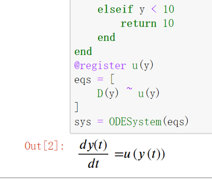
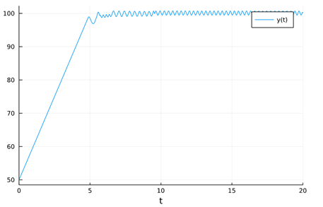
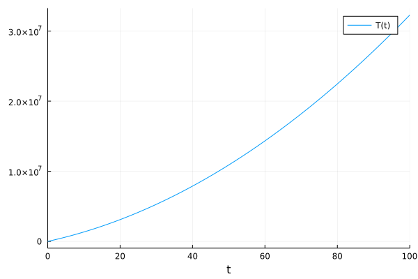

# ModelingToolkit调用外部函数

!!! tip
    Contents：建模、MTK、外部函数

    Contributor: YJY

    Email:522432938@qq.com

    如有错误，请批评指正。

!!! note

    MTK = ModelingToolkit.jl

    [ModelingToolkit.jl](https://mtk.sciml.ai/stable/)为基于符号系统的建模工具包。

    MTK-Version:8.5 及以上

## 提出问题

在前面的[ModelingToolkit建模方法](./MTK_intro.md)中提到，符号系统是MTK的基石。那么，如果想加入一个外部函数，应该怎么解决？例如方程：

$$f(x,y) + x + y = 1$$

## 解决方案

把**函数的调用符号化**——`@register`，一切问题就解决了！

也就是说，把函数名称放入符号系统中去。和定义符号变量类型，对相关函数进行声明，声明该函数纳入符号系统，即可完成操作。

## 实例

考虑一个简单系统：

```math
\frac{dy}{dt}  = u(y) \\ u(y)= \left\{\begin{aligned}
10, &~~ y<10 \\
-10, &~~ y \geq 100
\end{aligned}\right. 
```

这里函数u在编程时，很显然需要用if-else语句来描述。那么我们构造一个外部函数，这个外部函数为u，包含if-else的判断。(也可以用Ifelse包，包含了符号化的判断函数)

---

通过MTK构建：

```julia
using ModelingToolkit,DifferentialEquations
@variables t y(t)
D = Differential(t)
function u(y)
    if y > 100.0
        return -10.0
    else
        return 10.0
    end
end
@register u(y)
eqs = [
    D(y) ~ u(y)
]
@named sys = ODESystem(eqs)
```

可以看到得到的方程中，u被视为函数，它的参数为y(t)。

  

求解问题：

```julia
sys = structural_simplify(sys)
u0=[y => 50.0]
tspan = (0.0,20.0)
prob = ODEProblem(sys,u0,tspan,[])
sol = solve(prob)
using Plots
plot(sol)
```

  

可以看到成功求解，并且y在100附近波动。这是我们期望的结果。

## 实例——CoolProp

[CoolProp](../Tools/CoolProp.md)一个开源的调用物性包，通过几行代码就可以很容易的调用流体的物性。如何在符号系统中使用Coolprop函数调用物性呢？同样，也是使用外部函数，在外部函数中封装物性查询，将函数符号化即可。

**测试问题**：在1MPa下，求温度从300K-400K的水蒸气焓值累加和。（虽然这样做很没有意义，但是这是一种测试外部函数的有效并且简单的方法）

```julia
using ModelingToolkit,CoolProp,DifferentialEquations
@variables t T(t)
D = Differential(t)
function u(t)
    PropsSI("H","P",1.0E6,"T",t,"Water")
end
@register u(t)
eqs = [
    D(T) ~ u(t+300.0)
]
@named sys = ODESystem(eqs)
sys = structural_simplify(sys)
u0=[
    T => 0.0
]
tspan = (0.0,100.0)
prob = ODEProblem(sys,u0,tspan,[])
sol = solve(prob)
using Plots
plot(sol)
```

程序可以运行并且得到了结果，

  

MTK符号运算系统加上外部调用函数符号化，基本上可以解决各类仿真问题。

!!! note
    个人观点：

    从仿真层面来说，MTK具有了作为一个仿真引擎的所有功能。

    从程序开发层面来说，MTK具备搭建一个巨型系统的潜力。
